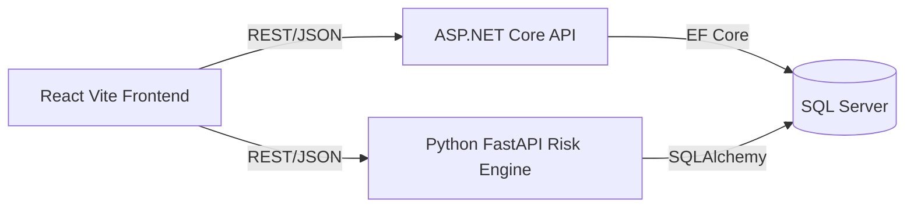

# Vantage — Trading Portfolio & Risk Management System (TPPMSG8)

Vantage is an institutional-grade Portfolio, Position, and Risk Management application. It provides trade blotter viewing, End-of-Day (EOD) Profit & Loss (PnL) calculations, and quantitative risk metrics via a Monte Carlo simulation engine.

## Table of Contents

- [System Architecture](#system-architecture)
- [Key Features](#key-features)
- [Getting Started](#getting-started)
  - [Prerequisites](#prerequisites)
  - [1. Database Setup](#1-database-setup)
  - [2. Backend API Setup](#2-backend-api-setup)
  - [3. Quant Risk Engine Setup](#3-quant-risk-engine-setup)
  - [4. Frontend Setup](#4-frontend-setup)
  - [Running the Application](#running-the-application)
- [Project Structure](#project-structure)
- [Configuration Reference](#configuration-reference)

---

## System Architecture

The application is built using a modern microservices architecture:

- **Frontend:** React.js (Vite), React Query for state management, Chart.js for data visualization.
- **Main API:** ASP.NET Core (C#), Entity Framework Core (Repository/Service Pattern).
- **Quant Risk Engine:** Python, FastAPI, Pandas, NumPy, SQLAlchemy.
- **Database:** Microsoft SQL Server.



## Key Features

### 1. Portfolio & Position Management
- **Dynamic Positions:** Automatically calculates Net Quantity and Average Cost based on historical BUY/SELL trades up to a specific "As Of Date".
- **PnL Calculation:** Computes Realized, Unrealized, and Total PnL by comparing trade execution prices against historical EOD market prices.
- **Trade Blotter:** Paginated, filterable grid displaying comprehensive trade history.

### 2. Quant Risk Engine (Microservice)
- **Value at Risk (VaR):** Calculates 1-Day VaR at 95% and 99% confidence intervals.
- **Monte Carlo Simulation:** Uses Pandas and NumPy to run 10,000 market simulations based on the actual 1-year historical volatility and drift of the selected securities.

### 3. Advanced Database Implementation
The application pushes heavy data-processing down to the SQL Server layer for maximum performance:
- **Multistatement Table-Valued Functions & CTEs:** `G8.fn_GetLatestEodPrices` uses Window Functions (`ROW_NUMBER()`) to efficiently query the most recent pricing data.
- **SQL Views:** `G8.vw_ActiveTraders` safely encapsulates JOIN logic to filter active participants.
- **Covering Indexes:** Strategic `INCLUDE` indexes prevent Key Lookups during heavy PnL calculations.

## Getting Started

### Prerequisites
- [.NET 8.0 SDK](https://dotnet.microsoft.com/download)
- [Python 3.10+](https://www.python.org/downloads/)
- [Node.js 18+](https://nodejs.org/)
- Microsoft SQL Server & SSMS or Azure Data Studio
- Sample data files for `Trades`, `Securities`, and `EOD_Prices` in `.csv` format

Follow the steps below in order to set up the database, run the backend services, and start the frontend UI.

### 1. Database Setup
1. Open **SQL Server Management Studio (SSMS)** or Azure Data Studio.
2. Create a new database (e.g., `VantageTradingDB`).
3. For each of `Trades`, `Securities`, and `EOD_Prices`: right-click the database → **Tasks → Import Flat File**, and step through the wizard to load the matching `.csv` file into its table which also creates the table on the go.
4. Run `DBScript.sql` (in the project root) to create the `G8` schema, indexes, views, and f4unctions.

### 2. Backend API Setup
1. Clone this repository to your local machine — the project root is `FinalProjectG8`.
2. Navigate to `FinalProjectG8/Backend`. This folder contains `TPPMSG8.sln` plus five projects: `TPPMSG8.Api`, `TPPMSG8.Application`, `TPPMSG8.Domain`, `TPPMSG8.Infrastructure`, and `TPPMSG8.Tests`.
3. Store the database connection string as a user secret so it's never committed to source control. In Visual Studio, right-click **TPPMSG8.Api** → **Manage User Secrets**, and paste:
   ```json
   {
     "ConnectionStrings": {
       "DefaultConnection": "Server=; Database=; User Id=; Password=; TrustServerCertificate=True;"
     }
   }
   ```
4. Set the same secret from the command line, inside `Backend/TPPMSG8.Api`:
   ```bash
   dotnet user-secrets init
   dotnet user-secrets set "ConnectionStrings:DefaultConnection" "Server=<your-server>;Database=VantageTradingDB; User Id=<your-user>; Password=<your-password>;TrustServerCertificate=True;"
   ```
5. Restore dependencies and run the API from `Backend/`:
   ```bash
   dotnet restore
   dotnet run --project TPPMSG8.Api
   ```

### 3. Quant Risk Engine Setup
1. Navigate to `FinalProjectG8/SkillEngine`.
2. Create and activate a virtual environment:
   ```bash
   python -m venv venv
   # Windows
   venv\Scripts\activate
   # macOS/Linux
   source venv/bin/activate
   ```
3. Install dependencies. **Note:** `requirements.txt` is currently empty in this repo — add the packages the service needs (typically `fastapi`, `uvicorn`, `pandas`, `numpy`, `sqlalchemy`, `pyodbc`, `python-dotenv`) before running:
   ```bash
   pip install -r requirements.txt
   ```
4. `SkillEngine/.env` Set the Database credentials in an .env file so that SqlAlchemy can fetch historical Data e.g.:
   ```
    DDB_SERVER=
    DB_NAME=
    DB_USER=
    DB_PASSWORD=
   ```
5. Start the service (`main.py` is the entry point):
   ```bash
   uvicorn main:app --reload --port 8000
   ```

### 4. Frontend Setup
1. Navigate to `FinalProjectG8/Frontend`.
2. Install dependencies:
   ```bash
   npm install
   npm install axios @tanstack/react-query chart.js react-chartjs-2 react-router-dom
   ```
3. Point the frontend at your running services. Check for a `.env` file using Vite's `VITE_` prefix convention:
   ```
   VITE_API_BASE_URL=
   VITE_RISK_ENGINE_URL=
   ```
4. Start the dev server:
   ```bash
   npm run dev
   ```

### Running the Application
Once everything is configured, start each piece in this order:
1. Confirm SQL Server is running and `VantageTradingDB` is populated.
2. Start the Main API (`dotnet run` from `TPPMSG8.Api`).
3. Start the Quant Risk Engine (`uvicorn main:app --reload`).
4. Start the Frontend (`npm run dev`) and open it in your browser.

## Project Structure

```
FinalProjectG8/
├── .github/
├── Backend/
│   ├── TPPMSG8.Api/                # ASP.NET Core Web API (entry point)
│   │   ├── Controllers/            # Pnl, PositionsTable, Securities, Trades
│   │   ├── Middleware/              # ExceptionHandlingMiddleware
│   │   ├── Properties/              # launchSettings.json
│   │   ├── logs/                    # Serilog daily log files
│   │   └── TPPMSG8.Api.http         # manual endpoint testing
│   ├── TPPMSG8.Application/         # DTOs, interfaces, services
│   │   ├── DTOs/
│   │   ├── Interfaces/
│   │   └── Services/                # PnlService, PositionsTableService
│   ├── TPPMSG8.Domain/              # entities
│   │   └── Models/                  # EodPrice, Security, Trade, Trader
│   ├── TPPMSG8.Infrastructure/      # EF Core + repositories
│   │   ├── DataAccess/              # AppDbContext
│   │   └── Respositories/           # (sic) Eod/Positions/Security/Trade repos
│   ├── TPPMSG8.Tests/               # controller & service tests
│   └── TPPMSG8.sln
├── Frontend/                        # React + Vite client
│   ├── public/
│   └── src/
│       ├── assets/
│       └── components/              # PnL, Positions, TradeBlotter, TradingDashboard, NoMatch
├── SkillEngine/                     # Python FastAPI quant risk service
│   ├── main.py
│   ├── .env
│   └── requirements.txt
├── DBScript.sql                     # schema, procedures, views, functions, indexes
└── .gitignore
```

## Configuration Reference

| Service | Setting | Purpose |
|---|---|---|
| Main API | `ConnectionStrings:DefaultConnection` | SQL Server connection string, set via `dotnet user-secrets` (not committed to source) |
| Risk Engine | `DDB_SERVER= DB_NAME= DB_USER= DB_PASSWORD=` | SQLAlchemy generates connection string to connect to SQL Server using these details, set in `SkillEngine/.env` |
| Frontend | `VITE_API_BASE_URL` | Base URL of the Main API |
| Frontend | `VITE_RISK_ENGINE_URL` | Base URL of the Quant Risk Engine |